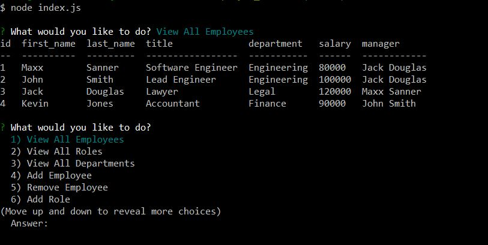

# Employee Tracker
UCI Boot Camp Homework 12 - Employee Tracker

Click [HERE]() for video demonstration of deployed application.

## Description 
 This was the twelth homework assignment for the full stack web development program at UC Irvine, in which the goal was to build a CLI based Content Management System that allows the use to manage a company's employees. It gives the user the ability to create, read, update, and delete information about different employees, roles, and departments. 

## Table of Contents 
* [Technologies](#Technologies)
* [Usage](#Usage)
* [License](#License)
* [Badges](#Badges)
* [Tests](#Tests)
* [Questions](#Questions)

## Technologies 
* This application is written in Javascript and uses MySQL for creating, reading, updating, and deleting data from a database.
* This application uses the inquirer, mysql, and cTable npm packages. 
* Lastly, it requires node.js to run it.

## Usage 
Open a terminal and run the application using the 'node index.js' command. It will start by asking you what you want to do. There is a list of 11 options (View All Employees, View All Roles, View All Departments, Add Employee, Remove Employee, Add Role, Remove Role, Add Department, Update Department, Update Employee Role, and Exit). When choosinf any of the "View" options, the user is shown a console.table of the corresponding data currently present in the database (the app starts with a seed of bogus entries). Choosing any of the 'Add' options will prompt you with a series of questions so that you can add all the necessary information to the corresponding table (for example, choosing 'Add Employee' will ask for the employee's first name, last name, role, and manager). Choosing any of the 'Remove' options will simply allow you to remove and item from the corresponding table. The 'Update Employee Role' option allows you to change the role title for any employee. Lastly, 'Exit' will end the connection.

## License 
 ISC

## Badges 
 
 

## Tests 
 No tests are currently in place for this project.

 ## Future Development
 I will be adding the following features in a future rev:
 * Ability to update employee managers
 * Ability to view employees by manager
 * Ability to view all employees by department
 * View the total utilized budget of a department

## Questions 
 For any questions, contact me at [maxxsanner105@gmail.com](mailto:maxxsanner105@gmail.com).
#### 